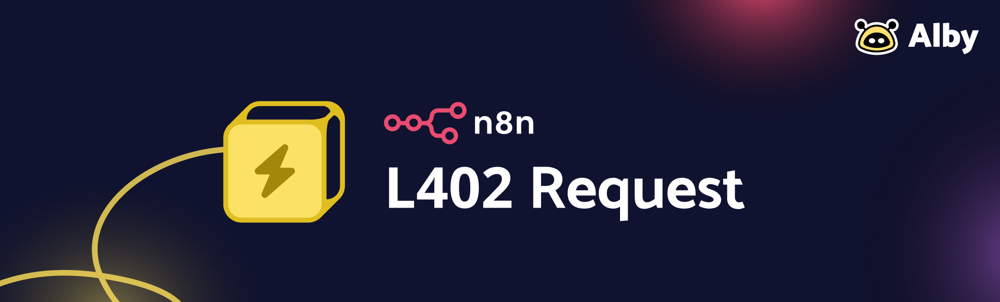
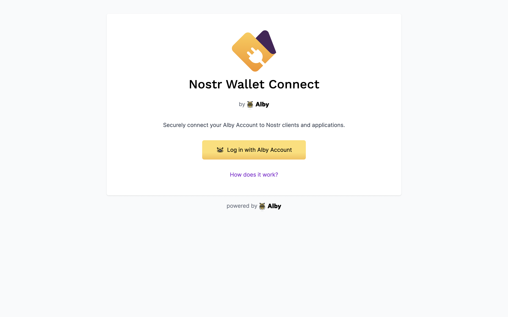
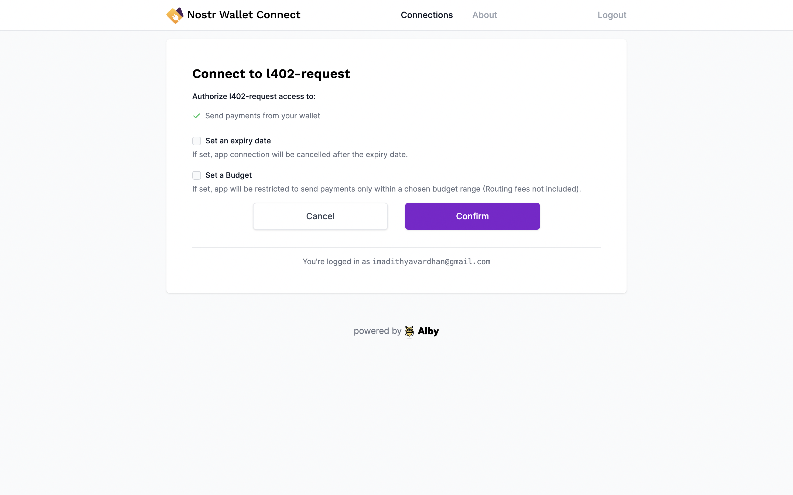
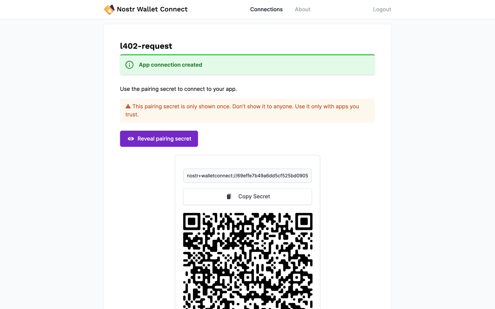
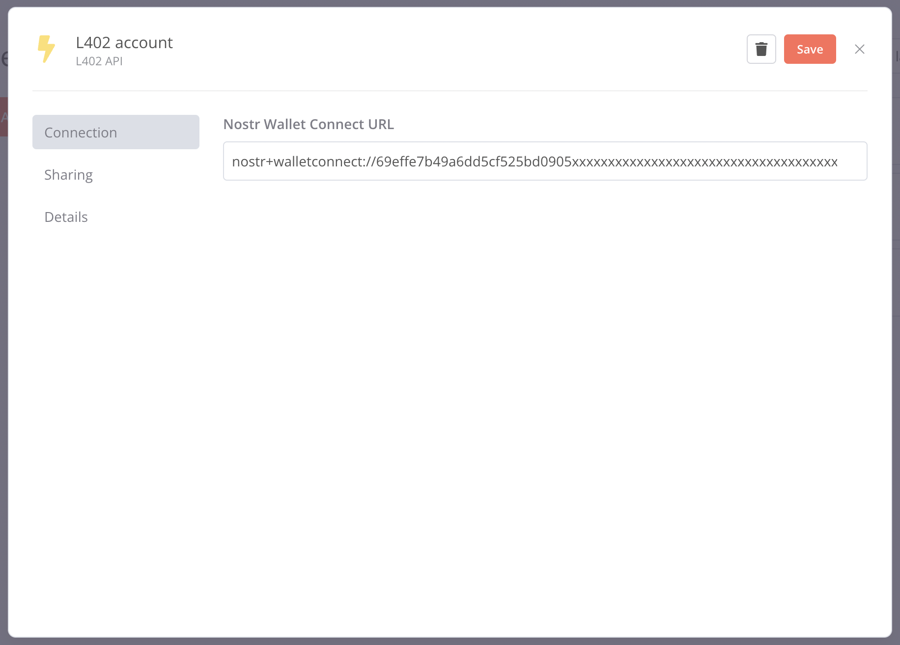

# n8n-nodes-l402-request

This is an [n8n](n8n.io) community node for [L402](https://docs.lightning.engineering/the-lightning-network/l402) endpoints. Lets you make L402 requests using [Nostr Wallet Connect](https://nwc.getalby.com/).

L402, formerly known as LSAT, is a standard to support the use case of charging for services and authenticating users in distributed networks. It combines the strengths of Macaroons for better authentication with the strengths of the Lightning Network for better payments.

[n8n](n8n.io) is a [fair-code licensed](https://docs.n8n.io/reference/license/) workflow automation platform.

## How to install

### Community Nodes (Recommended)
- Go to **Settings > Community Nodes**.
- Select **Install**.
- Enter `n8n-nodes-l402-request` in **Enter npm Package Name**.
- Agree to the [risks](https://docs.n8n.io/integrations/community-nodes/risks/) of using community nodes: select **I understand the risks of installing unverified code from a public source**.
- Select **Install**.

After installing the node, you can use it like any other node. n8n displays the node in search results in the Nodes panel.

### Manual installation

To get started install the package in your n8n root directory:

`npm install n8n-nodes-l402-request`

For Docker-based deployments, add the following line before the font installation command in your n8n Dockerfile:

`RUN cd /usr/local/lib/node_modules/n8n && npm install n8n-nodes-l402-request`

## NWC Setup

In order to make payments for the L402 Requests, you have to add L402 credentials which would be your [Nostr Wallet Connect](https://nwc.getalby.com/) connection string.

First login to NWC using your [Alby](https://getalby.com) Account.

After that, you can either click on **New Connection** to name your app or create an application using [this link](https://nwc.getalby.com/apps/new?c=l402-request) directly.

(You can also set your budget, budget renewal and expiry date for the NWC connection)

Once done, click on **Reveal Pairing Secret** and copy the Secret.

### Adding NWC Credentials

- After copying the secret, open n8n and go to **Credentials > Add Credential**.
- Search for **L402 API**.
- Select **Continue**.
- Paste your NWC Secret in the **Nostr Wallet Connect URL** Input Field.
- Don't forget to click on **Save**!

## L402 Request Node Reference

- **Credential for L402 Node:** If you followed the NWC setup guide above, you will be able to select your L402 credentials to make requests.
- **Method:** You can use any HTTP method to make the request as long as the endpoint supports L402.
- **URL:** Enter the URL of the endpoint and click **Execute Node**. That should be it to start making L402 Requests within your workflow!

## License

MIT License

Copyright (c) 2023 Alby Contributors <hello@getalby.com>
